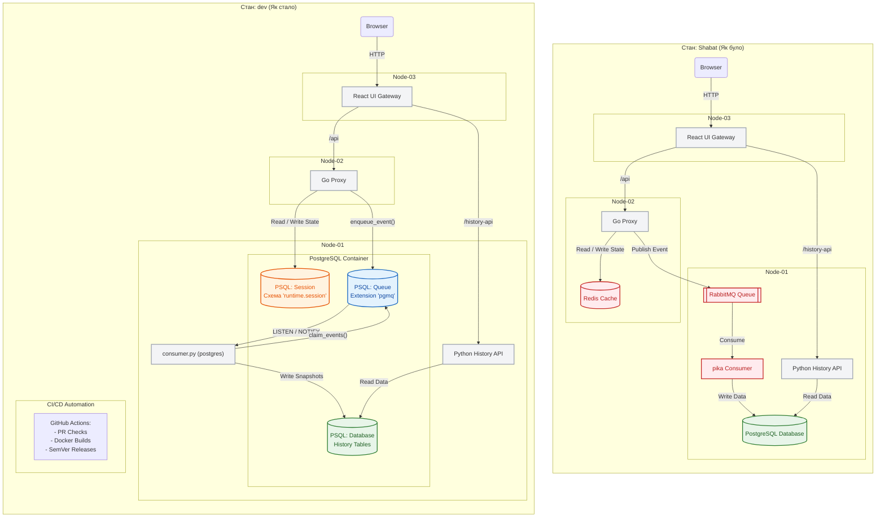

# Coin-Ops

Coin-Ops is a distributed Polymarket dashboard deployed across three VMs. The system uses a PostgreSQL-native runtime architecture, consolidating queue and session state management directly into PostgreSQL (live market caches remain in-process). 

The major "Repo Foundation", "PostgreSQL Migration", and "Test Pyramid" phases (April 2026) are successfully completed on `dev`:

- **Infrastructure:** CI/CD gating, SemVer releases, and local Compose workflows (`make verify`) are fully operational.
- **Runtime Backend:** Proxy and Consumer services have fully cut over to `RUNTIME_BACKEND=postgres`, consolidating queue and session state natively in PostgreSQL.
- **Validation:** A comprehensive Test Pyramid is in place, covering unit tests (Go, Python, React), integration tests (PostgreSQL-backed), and end-to-end smoke suites (#44, #46, #47, #49, #50), all wired into CI (#52).

**Current Focus & Next Steps:**

- **Legacy Cleanup:** Physically removing RabbitMQ and Redis completely from infrastructure provisioning (#12, PR #48).
- **Frontend Porting:** Porting the React frontend to the PostgreSQL-runtime architecture and integrating cross-branch improvements (#14).
- **Documentation:** Finalizing the migration and demo runbook (#13, PR #51).

**[Read the Documentation](docs/)** | **[How to Contribute](CONTRIBUTING.md)**

## Status Snapshot

| Topic | Current repo state on `dev` | Next planned step |
| --- | --- | --- |
| Runtime backend | Default deployed path is `postgres`: queue and session state consolidated in PostgreSQL | Monitor and optimize PostgreSQL runtime load |
| Runtime queue assets | Proxy and consumer use `pgmq` queue SQL, DLQ, and `LISTEN/NOTIFY` via `runtime/` schema | Remove remaining legacy dead code if any |
| Frontend contract | same-origin `/api` and `/history-api` | keep the same HTTP contract |
| Deployment shape | Docker Compose on three VMs via Ansible | keep the three-VM story |
| Image publishing | `Shabat` -> `shabat-latest`, `dev` -> `dev-latest`, tags -> `vX.Y.Z` | use moving branch tags for integration/demo deploys and tags for pinned releases |
| Validation | PR checks run on pull requests into `dev` | extend the test pyramid beyond the current baseline over time |

## Architecture



> **Note:** The runtime mode is now PostgreSQL-native (`RUNTIME_BACKEND=postgres`). The legacy mode using RabbitMQ and Redis (`RUNTIME_BACKEND=external`) is kept as a fallback.
> -> See `docs/migration-runbook.md` for migration steps and rollback procedures.
> -> See `docs/adr/0001-postgres-runtime.md` for design decisions.

| VM | IP | Runtime services |
| --- | --- | --- |
| node-01 | `172.31.1.10` | PostgreSQL, history consumer, history API |
| node-02 | `172.31.1.11` | Go proxy |
| node-03 | `172.31.1.12` | nginx gateway, React SPA |


## Current Data Flow

| Path | Flow | Purpose |
| --- | --- | --- |
| Live path | Browser -> `/api` -> Go proxy -> external APIs -> Browser | fast live market data |
| Write path | Go proxy -> PostgreSQL (pgmq) -> Python consumer -> PostgreSQL | async persistence |
| History path | Browser -> `/history-api` -> FastAPI -> PostgreSQL -> Browser | chart time series |
| Session path | Browser -> `/api/state` -> PostgreSQL (UNLOGGED) | short-lived UI state |

The browser does not call `172.31.1.10:8000` or `172.31.1.11:8080` directly. Node-03 keeps the frontend same-origin by reverse-proxying `/api` and `/history-api`.

## Roadmap Status

### Already adopted on `dev`

- `dev` is the intended integration branch
- PR checks exist in `.github/workflows/pr-checks.yml`
- GHCR publishing for `dev-latest` exists in `.github/workflows/docker-images.yml`
- PostgreSQL queue-side runtime SQL and `runtime_consumer.py` exist under `runtime/`

### Completed migrations

- added `RUNTIME_BACKEND=external|postgres` wiring to proxy and consumer startup paths
- switched proxy event publishing from RabbitMQ to `runtime.enqueue_event(...)`
- added PostgreSQL worker routing inside `history/consumer.py` via `RUNTIME_BACKEND`
- wired runtime schema/bootstrap into Ansible and Compose
- moved Redis-backed session state into PostgreSQL runtime primitives (live caches remain in-process)
- deprecated RabbitMQ and Redis as primary dependencies

## Tech Stack

| Layer | Tech |
| --- | --- |
| Frontend | React, Vite, TypeScript, Tailwind, Recharts |
| Live gateway | Go |
| History API and current consumer | Python, FastAPI, pgmq (pika for fallback) |
| Queue | PostgreSQL `pgmq` (RabbitMQ for fallback) |
| Database | PostgreSQL |
| Session/runtime state | PostgreSQL `UNLOGGED` tables (Redis for fallback) |
| Containers | Docker, Docker Compose |
| Infrastructure | Terraform for VM provisioning, Ansible for deployment |
| Web server | nginx |

## Repository Layout

```text
.
|-- ansible/          # provisioning and deployment automation
|-- deploy/compose/   # per-node Docker Compose stacks
|-- docs/             # architecture, deployment, and runbook notes
|-- history/          # FastAPI history API, consumer (pika fallback), schema
|-- proxy/            # Go live-data proxy
|-- runtime/          # PostgreSQL runtime queue SQL and pgmq-backed consumer assets
|-- terraform/        # VM and network provisioning
|-- ui/               # legacy static UI
`-- ui-react/         # main React/Vite frontend
```

## Container Images

Each application service has its own Dockerfile.

| Image | Dockerfile | Runtime shape |
| --- | --- | --- |
| Go proxy | `proxy/Dockerfile` | multi-stage build, `golang:1.22-alpine` builder, `scratch` runtime |
| History API | `history/Dockerfile.api` | `python:3.12-slim-bookworm` |
| History consumer | `history/Dockerfile.consumer` | `python:3.12-slim-bookworm` |
| UI | `ui-react/Dockerfile` | `node:22-bookworm-slim` builder, `nginx:alpine` runtime |

Official images are used for PostgreSQL. The queue-side PostgreSQL runtime SQL requires `pgmq` to be available in PostgreSQL. RabbitMQ and Redis images are also available if the `external` fallback mode is used.

## Deployment Model

Application images are built by GitHub Actions and pushed to GitHub Container Registry.

```text
push to Shabat
  -> publish shabat-latest

push to dev
  -> publish dev-latest

push tag vX.Y.Z
  -> publish immutable release images

Ansible deploy
  -> renders per-node Compose files and env files
  -> Docker Compose pulls tagged images
  -> containers start on node-01, node-02, and node-03
```

## Branches and Release Tags

Current branch and publishing model:

- `feature/*` -> PR -> `dev`
- `dev` is the integration branch
- `main` remains stable/release-oriented
- `Shabat` publishes moving `shabat-latest`
- `dev` publishes moving `dev-latest`
- `vX.Y.Z` publishes immutable release tags

Release tags are automated from Conventional Commit style squash merge titles on `main`. See [Release Automation](docs/release-automation.md) for the version bump rules and maintainer workflow.

## Public Gateway and TLS

Node-03 is the browser-facing gateway. It serves the React UI and reverse-proxies the backend paths:

```text
https://coinops.test/              -> React UI
https://coinops.test/api/*         -> node-02 proxy
https://coinops.test/history-api/* -> node-01 history API
```

For local lab HTTPS, keep `APP_DOMAIN=coinops.test`, `TLS_MODE=selfsigned`, and add this hosts entry on the machine running the browser:

```text
172.31.1.12 coinops.test
```

## Secrets and Runtime Configuration

Secrets are not baked into images. Ansible writes root-owned env files on the VMs under `/etc/cognitor/`, and Docker Compose injects those values at container startup with `env_file`.

Current runtime env highlights:

- proxy: `DATABASE_URL`, `RUNTIME_BACKEND=postgres`, `PORT`
- history: `DATABASE_URL`, `RUNTIME_BACKEND=postgres`, `POSTGRES_*`, `PORT`
- ui: `PROXY_URL=/api`, `HISTORY_URL=/history-api`

Legacy mode env variables (if `RUNTIME_BACKEND=external`):

- proxy: `RABBITMQ_URL`, `REDIS_URL`
- history: `RABBITMQ_URL`

## Deployment Commands

Prepare environment variables first:

```bash
cp .env.example .env
source .env
```

For the local root `docker compose` flow, use a plain Compose `.env` file and the root `Makefile` convenience targets:

```bash
cp .env.compose.example .env
make local-up
```

Equivalent direct Compose command:

```bash
docker compose up --build
```

This local flow is a developer convenience stack for the default root Compose setup. It does not replace the VM-based Terraform + Ansible deployment flow.

Install pinned Ansible collections:

```bash
ansible-galaxy collection install -r ansible/requirements.yml
```

Provision infrastructure:

```bash
terraform -chdir=terraform apply
```

Install host dependencies and Docker:

```bash
ansible-playbook -i ansible/inventory ansible/provision.yml
```

Deploy application containers:

```bash
ansible-playbook -i ansible/inventory ansible/deploy.yml
```

Current moving-tag deploys:

```bash
IMAGE_TAG=shabat-latest ansible-playbook -i ansible/inventory ansible/deploy.yml
IMAGE_TAG=dev-latest ansible-playbook -i ansible/inventory ansible/deploy.yml
```

Pinned release deploy:

```bash
IMAGE_TAG=v0.1.0 ansible-playbook -i ansible/inventory ansible/deploy.yml
```

## Local Development

Quick local Compose workflow:

```bash
cp .env.compose.example .env
make local-up
```

Open the app at `http://localhost:5000`.

Useful local commands:

```bash
make local-logs
make local-ps
make local-down
make local-restart
make local-config
```

Frontend:

```bash
cd ui-react
npm install
npm run dev
npm run lint
npm run build
```

Go proxy:

```bash
cd proxy
make run
make build
```

Python history services:

```bash
cd history
python -m venv venv
source venv/bin/activate
pip install -r requirements.txt
python main.py
python consumer.py
```

Queue-side PostgreSQL runtime assets:

```bash
psql "$DATABASE_URL" -f runtime/00_run_all.sql
python runtime/runtime_consumer.py
```

Fast Python unit tests for both the current `external` path and the PostgreSQL runtime target:

```bash
cd <repo-root>
python -m venv venv
source venv/bin/activate
pip install -r history/requirements-dev.txt
python -m pytest tests/python/unit
```

If you are already in `history/`, either `cd ..` first or run `python -m pytest ../tests/python/unit`.

The fast `pytest` suite lives under `tests/python/unit`. Keep PostgreSQL-backed integration coverage separate from these unit tests.

PostgreSQL-backed integration tests for `history/main.py` and the queue-side PostgreSQL consumer in `runtime/runtime_consumer.py` (requires Docker):

```bash
cd <repo-root>
python -m venv venv
source venv/bin/activate
pip install -r history/requirements-dev.txt
python -m pytest tests/python/integration -v
```

These integration tests boot an ephemeral runtime-ready PostgreSQL container (`quay.io/tembo/pg16-pgmq@sha256:7f80d046257d585d1af9d19cf28bd355a4b854b0a7d643c02ebbe6b84457868a` by default, override with `COINOPS_TEST_POSTGRES_IMAGE`), apply `history/schema.sql` plus `runtime/00_run_all.sql`, and validate real history read/write behavior through the actual PostgreSQL queue path.

They do not replace the broader runtime smoke tests in `runtime/tests/test_runtime.sql`; cache/session `pg_cron` coverage still lives there.

## External Data Sources

| Source | Data |
| --- | --- |
| `gamma-api.polymarket.com` | live market metadata |
| `data-api.polymarket.com` | whale leaderboard and positions |
| `api.coingecko.com` | BTC and ETH prices |
| `bank.gov.ua` | USD/UAH reference rate |

These are public unauthenticated APIs, so live behavior depends on upstream availability and rate limits.

## More Detail

- [docs/architecture.md](docs/architecture.md) explains the system architecture and service responsibilities.
- [docs/runtime-queue-architecture.md](docs/runtime-queue-architecture.md) focuses on the queue-side PostgreSQL runtime design and its current status on `dev`.
