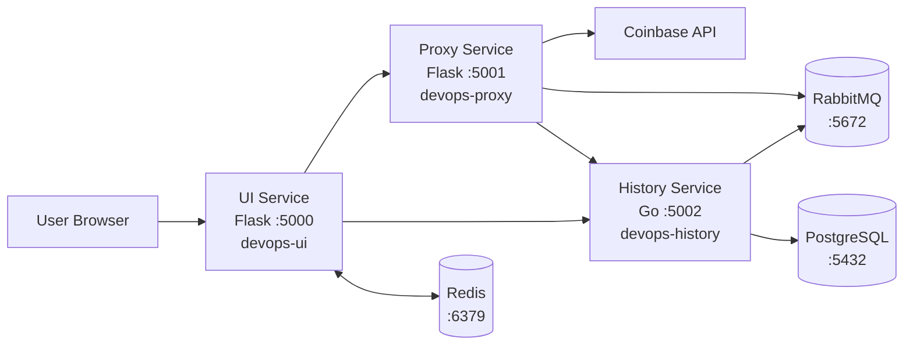

# Currency Rates Tracker

Multi-service pet project for collecting, storing and displaying cryptocurrency prices in a small Vagrant-based environment, with an optional Docker Compose app layer.

## Table of Contents

- [Architecture Diagram](#architecture-diagram)
- [Architecture](#architecture)
- [VM Layout](#vm-layout)
- [Repository Structure](#repository-structure)
- [Configuration](#configuration)
- [Deployment](#deployment)
- [Services and Ports](#services-and-ports)
- [Systemd Units](#systemd-units)
- [Data Flow Details](#data-flow-details)
- [Troubleshooting](#troubleshooting)
- [Useful Commands](#useful-commands)
- [Persistence](#persistence)
- [Future Improvements](#future-improvements)

## Architecture Diagram



GitHub renders Mermaid diagrams directly, so this section can be used as a navigable architecture view inside the repository page.

The project provisions 4 virtual machines with Vagrant and configures them with Ansible:

- `devops-ui` hosts the Flask web UI
- `devops-proxy` fetches current coin prices from Coinbase and sends them to RabbitMQ
- `devops-history` consumes RabbitMQ messages and stores them in PostgreSQL
- `devops-data` runs PostgreSQL, RabbitMQ and Redis

## Architecture

Request flow:

1. User opens the UI on `devops-ui`
2. UI requests a live price from `proxy`
3. `proxy` fetches the spot price from Coinbase
4. `proxy` publishes price messages to RabbitMQ
5. `history` consumes messages from RabbitMQ and stores them in PostgreSQL
6. UI requests historical data and chart data from `history`
7. Flask session state is stored in Redis

Main technologies:

- Vagrant
- Ansible
- Docker Compose
- Python / Flask
- Go
- PostgreSQL
- RabbitMQ
- Redis
- systemd

## VM Layout

| VM | Role | IP | Main services |
| --- | --- | --- | --- |
| `devops-ui` | frontend | `192.168.56.11` | Flask UI |
| `devops-proxy` | API proxy | `192.168.56.12` | Flask proxy |
| `devops-history` | history backend | `192.168.56.13` | Go service |
| `devops-data` | data layer | `192.168.56.14` | PostgreSQL, RabbitMQ, Redis |

SSH forwarded ports:

- `2222` -> `devops-ui`
- `2223` -> `devops-proxy`
- `2224` -> `devops-history`
- `2225` -> `devops-data`

## Repository Structure

```text
.
├── Vagrantfile
├── deploy.sh
├── docker-compose.yml
├── .env
├── .env.example
├── ansible/
│   ├── inventory.ini
│   ├── host_vars/
│   ├── site.yml
│   ├── group_vars/
│   │   └── all/
│   │       ├── main.yml
│   │       └── vault.yml
│   └── roles/
├── proxy_service/
├── history_service/
└── ui/
```

## Configuration

Non-secret variables should live in `ansible/group_vars/all/main.yml`.

Example:

```yaml
postgres_host: 192.168.56.14
rabbitmq_host: 192.168.56.14
redis_host: 192.168.56.14
proxy_host: 192.168.56.12
history_host: 192.168.56.13

postgres_db: currency_rates_tracker
postgres_table: currency_rates
postgres_user: currency_app_user
rabbitmq_user: currency_app_user
rabbitmq_queue: currency_rates
redis_port: 6379
```

Secret variables should live in `ansible/group_vars/all/vault.yml` and be encrypted with `ansible-vault`.

Recommended keys:

```yaml
postgres_password: "devpass123"
pgadmin_login: "postgres"
pgadmin_login_password: "coinops"
rabbitmq_password: "devpass123"
redis_password: "devpass123"
ui_secret_key: "dev-secret"
```

Notes:

- `ui_secret_key` can be any stable string in development
- `postgres_password` and `rabbitmq_password` can also be chosen by you, but must match the credentials created by Ansible and used by the services
- `pgadmin_login` and `pgadmin_login_password` are used by the PostgreSQL Ansible modules for administrative tasks
- `redis_password` must match the Redis password expected by the UI service
- `group_vars/all/vault.yml` is the correct location if you want Ansible to load the secrets automatically for all hosts

SSH private key paths for Vagrant machines are kept in `ansible/host_vars/` with repo-relative paths.

## Deployment

Bring up the environment and run Ansible:

```bash
./deploy.sh
```

Current `deploy.sh`:

```bash
#!/bin/bash
vagrant up
ansible-playbook ansible/site.yml --ask-vault-pass
```

You can also run the steps manually:

```bash
vagrant up
ansible-playbook ansible/site.yml --ask-vault-pass
```

If you already have a vault password file:

```bash
ansible-playbook ansible/site.yml --vault-password-file .vault_pass
```

### Docker Compose

The application layer can also run in Docker while the data layer stays on the Vagrant data VM.

Current mixed setup:

- `ui`, `proxy`, `history` run in Docker Compose
- PostgreSQL, RabbitMQ, and Redis stay on `devops-data`
- only the `devops-data` VM needs to be running for this mode

Setup:

```bash
vagrant up devops-data
cp .env.example .env
docker compose up --build
```

In this mode:

- UI is available on `http://localhost:5000`
- Proxy is available on `http://localhost:5001`
- History is available on `http://localhost:5002`

Container-to-container communication uses Docker service names:

- `PROXY_HOST=proxy`
- `HISTORY_HOST=history`

Container-to-VM communication uses the Vagrant data VM IP:

- `POSTGRES_HOST=192.168.56.14`
- `RABBITMQ_HOST=192.168.56.14`
- `REDIS_HOST=192.168.56.14`

Useful Docker commands:

```bash
docker compose up --build
docker compose down
docker compose ps
docker compose logs ui
docker compose logs proxy
docker compose logs history
docker images
docker ps -s
```

To re-run only one machine:

```bash
ansible-playbook ansible/site.yml --limit ui --ask-vault-pass
ansible-playbook ansible/site.yml --limit proxy --ask-vault-pass
ansible-playbook ansible/site.yml --limit history --ask-vault-pass
ansible-playbook ansible/site.yml --limit data --ask-vault-pass
```

## Services and Ports

### UI

- Host: `devops-ui`
- Port: `5000`
- Stack: Flask + Redis-backed sessions
- Main routes:
  - `/`
  - `/history`
  - `/api/chart-data`

Environment variables passed through systemd:

- `REDIS_HOST`
- `REDIS_PORT`
- `REDIS_PASSWORD`
- `PROXY_HOST`
- `HISTORY_HOST`
- `SECRET_KEY`

Docker:

- image build context: `ui/`
- published port: `5000:5000`

### Proxy Service

- Host: `devops-proxy`
- Port: `5001`
- Stack: Flask + Coinbase API + RabbitMQ
- Main route:
  - `/price/<coin>`

Supported coins:

- `BTC`
- `ETH`
- `SOL`
- `BNB`

Environment variables:

- `RABBITMQ_HOST`
- `RABBITMQ_USER`
- `RABBITMQ_PASS`
- `RABBITMQ_QUEUE`
- `HISTORY_HOST`

Docker:

- image build context: `proxy_service/`
- published port: `5001:5001`

### History Service

- Host: `devops-history`
- Port: `5002`
- Stack: Go + PostgreSQL + RabbitMQ consumer
- Main routes:
  - `/history`
  - `/stats`
  - `/chart`

Environment variables:

- `POSTGRES_HOST`
- `POSTGRES_DB`
- `POSTGRES_USER`
- `POSTGRES_PASS`
- `POSTGRES_TABLE`
- `RABBITMQ_HOST`
- `RABBITMQ_USER`
- `RABBITMQ_PASS`
- `RABBITMQ_QUEUE`

Docker:

- image build context: `history_service/`
- published port: `5002:5002`

### Data Services

- Host: `devops-data`
- PostgreSQL: `5432`
- RabbitMQ: `5672`
- RabbitMQ management: `15672`
- Redis: `6379`

## Systemd Units

The application services are deployed as systemd units:

- `ui.service`
- `proxy.service`
- `history.service`

Useful commands:

```bash
sudo systemctl status ui
sudo systemctl status proxy
sudo systemctl status history

sudo journalctl -u ui.service -n 50
sudo journalctl -u proxy.service -n 50
sudo journalctl -u history.service -n 50

sudo systemctl cat ui.service
sudo systemctl cat proxy.service
sudo systemctl cat history.service

sudo systemctl show ui.service -p Environment
sudo systemctl show proxy.service -p Environment
sudo systemctl show history.service -p Environment
```

## Data Flow Details

### Live price flow

1. UI calls `http://<proxy_host>:5001/price/<coin>`
2. Proxy fetches price from Coinbase
3. Proxy publishes the fetched price to RabbitMQ
4. Proxy sends the result to RabbitMQ
5. History service consumes the message and inserts it into PostgreSQL

### History flow

1. UI calls `http://<history_host>:5002/history`
2. History service reads filtered rows from PostgreSQL
3. UI renders the table

### Chart flow

1. UI calls `http://<history_host>:5002/chart`
2. History service loads price points from PostgreSQL
3. History service downsamples points depending on selected range
4. UI renders the chart

## Troubleshooting

### Vault variable is undefined

Symptom:

```text
'postgres_password' is undefined
```

Check:

- `vault.yml` is in `ansible/group_vars/all/vault.yml`
- the playbook is launched with `--ask-vault-pass` or `--vault-password-file`
- `vault.yml` actually contains the expected key

Useful command:

```bash
ansible-vault view ansible/group_vars/all/vault.yml
```

### Vault decryption failed

Symptom:

```text
Decryption failed (no vault secrets were found that could decrypt)
```

Meaning:

- wrong vault password
- wrong vault file
- file was encrypted with a different secret

### UI crashes with `REDIS_PORT` is `None`

Cause:

- rendered `ui.service` does not contain `Environment=REDIS_PORT=6379`

Check:

```bash
sudo systemctl cat ui.service
sudo systemctl show ui.service -p Environment
```

### UI returns HTTP 500 because of Redis

Check Redis on `devops-data`:

```bash
sudo systemctl status redis-server
ss -ltnp | grep 6379
grep '^bind' /etc/redis/redis.conf
grep '^protected-mode' /etc/redis/redis.conf
```

Expected Redis config for this lab:

```conf
bind 127.0.0.1 192.168.56.14
protected-mode no
```

### Proxy logs `RabbitMQ error: 'NoneType' object has no attribute 'encode'`

Cause:

- `RABBITMQ_PASS` or another RabbitMQ environment variable is missing in `proxy.service`

Check:

```bash
sudo systemctl cat proxy.service
sudo systemctl show proxy.service -p Environment
```

### History service fails with SQL syntax error near `(`

Cause:

- `POSTGRES_TABLE` is empty when the service starts

Check:

```bash
sudo systemctl cat history.service
sudo systemctl show history.service -p Environment
```

The history service must receive:

```ini
Environment=POSTGRES_TABLE=currency_rates
```

## Useful Commands

SSH into VMs:

```bash
vagrant ssh devops-ui
vagrant ssh devops-proxy
vagrant ssh devops-history
vagrant ssh devops-data
```

Re-run only one service role:

```bash
ansible-playbook ansible/site.yml --limit ui --ask-vault-pass
ansible-playbook ansible/site.yml --limit proxy --ask-vault-pass
ansible-playbook ansible/site.yml --limit history --ask-vault-pass
ansible-playbook ansible/site.yml --limit data --ask-vault-pass
```

Check data in PostgreSQL:

```bash
sudo -u postgres psql -d currency_rates_tracker
SELECT coin, price, recorded_at FROM currency_rates ORDER BY recorded_at DESC LIMIT 20;
```

Check RabbitMQ:

```bash
sudo rabbitmqctl list_queues
sudo rabbitmqctl list_users
```

## Persistence

Data persists as long as you keep the same VM disks.

If you run the project on another laptop, the data will not automatically appear there. To move the collected history between machines, export and restore the PostgreSQL database or move the VM disks.

## Future Improvements

- add a proper reverse proxy entry point
- add health checks for all services
- add tests for Python and Go services
- add a dedicated README for each service
- store deployment logs and metrics
- use production WSGI/HTTP servers instead of dev servers
