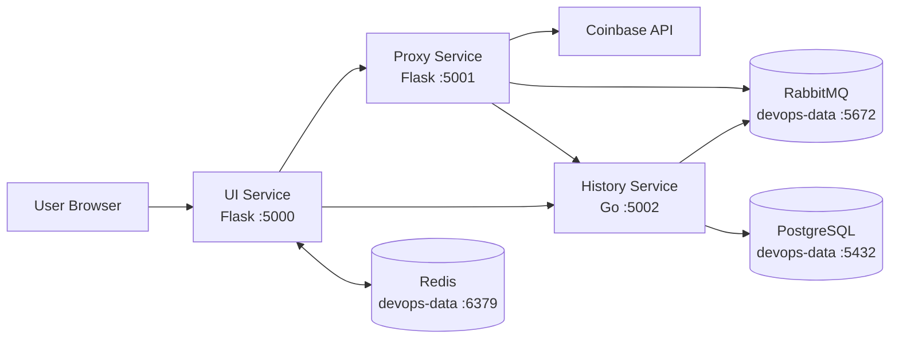

# Currency Rates Tracker

## Overview

Currency Rates Tracker is a small multi-service lab project for collecting, storing, and displaying cryptocurrency prices.

The supported deployment model is:

- one Vagrant VM named `devops-data`
- Ansible provisioning for PostgreSQL, RabbitMQ, and Redis on that VM
- Docker Compose for the application layer: `ui`, `proxy`, and `history`

## Architecture



Request flow:

1. The browser opens the UI on `http://localhost:5000`
2. The UI requests a live price from the proxy service
3. The proxy fetches the spot price from Coinbase
4. The proxy publishes price messages to RabbitMQ on `devops-data`
5. The history service consumes RabbitMQ messages and writes them to PostgreSQL on `devops-data`
6. The UI requests historical rows and chart points from the history service
7. The UI stores session state in Redis on `devops-data`

## Repository Structure

```text
.
├── Vagrantfile
├── deploy.sh
├── docker-compose.yml
├── .env
├── .env.example
├── ansible/
│   ├── inventory.ini
│   ├── group_vars/
│   ├── host_vars/
│   ├── roles/
│   ├── known_hosts
│   └── site.yml
├── ui/
├── proxy_service/
└── history_service/
```

Directory responsibilities:

- `Vagrantfile` defines the `devops-data` VM
- `deploy.sh` starts the VM, refreshes `known_hosts`, and runs Ansible
- `docker-compose.yml` starts the application containers
- `ansible/` provisions PostgreSQL, RabbitMQ, and Redis on `devops-data`
- `ui/` contains the Flask frontend
- `proxy_service/` contains the Flask live-price proxy
- `history_service/` contains the Go history worker/API

## Prerequisites

Install these tools on the host machine:

- Vagrant
- VirtualBox
- Docker Engine with Docker Compose
- Ansible

You also need:

- network access from the host and containers to the data VM
- a valid Ansible vault password for `ansible/group_vars/all/vault.yml`

## Configuration

### Docker Environment

Create the runtime environment file:

```bash
cp .env.example .env
```

Current `.env.example` values:

```dotenv
REDIS_HOST=192.168.56.14
REDIS_PORT=6379
REDIS_PASSWORD=coinops
PROXY_HOST=proxy
HISTORY_HOST=history
RABBITMQ_HOST=192.168.56.14
RABBITMQ_USER=currency_app_user
RABBITMQ_PASS=coinops
RABBITMQ_QUEUE=currency_rates
POSTGRES_HOST=192.168.56.14
POSTGRES_DB=currency_rates_tracker
POSTGRES_USER=currency_app_user
POSTGRES_PASS=password
POSTGRES_TABLE=currency_rates
SECRET_KEY=coinops
```

How those values are used:

- `PROXY_HOST=proxy` and `HISTORY_HOST=history` are Docker service names used for container-to-container communication
- `REDIS_HOST`, `RABBITMQ_HOST`, and `POSTGRES_HOST` point at the `devops-data` VM
- `SECRET_KEY` is used by the UI Flask app

### Ansible Variables

Non-secret shared values live in:

```text
ansible/group_vars/all/main.yml
```

Secrets live in:

```text
ansible/group_vars/all/vault.yml
```

The data-layer deployment depends on these values:

- PostgreSQL host, database, table, and application user
- RabbitMQ host, application user, and queue
- Redis host and port
- passwords for PostgreSQL, RabbitMQ, and Redis

## Deployment

There are two supported ways to start the environment.

### Option 1: Use `deploy.sh` and then start Docker

```bash
./deploy.sh
cp .env.example .env
docker compose up --build
```

What `deploy.sh` does:

1. starts the `devops-data` VM
2. refreshes `ansible/known_hosts` with the VM SSH host key
3. runs `ansible-playbook ansible/site.yml --ask-vault-pass`

### Option 2: Run the steps manually

```bash
vagrant up devops-data
: > ansible/known_hosts
ssh-keyscan -H 192.168.56.14 >> ansible/known_hosts
ansible-playbook ansible/site.yml --ask-vault-pass
cp .env.example .env
docker compose up --build
```

If you want containers in the background:

```bash
docker compose up --build -d
```

## Services And Ports

### UI

- container port: `5000`
- host access: `http://localhost:5000`
- responsibility: render the dashboard, history page, and chart data for the browser

### Proxy

- container port: `5001`
- host access: `http://localhost:5001`
- responsibility: fetch live prices from Coinbase and publish them to RabbitMQ

### History

- container port: `5002`
- host access: `http://localhost:5002`
- responsibility: consume queued price updates, store them in PostgreSQL, and serve history/chart endpoints

### Data VM

- VM name: `devops-data`
- private IP: `192.168.56.14`
- services:
  - PostgreSQL on `5432`
  - RabbitMQ on `5672`
  - Redis on `6379`

## Data Flow

### Live Price Request

1. The browser loads the UI
2. The UI calls `http://proxy:5001/price/<coin>` from inside Docker
3. The proxy fetches the latest Coinbase spot price
4. The proxy sends the price message to RabbitMQ on `devops-data`
5. The UI displays the current price response immediately

### Historical Data Recording

1. The history service consumes RabbitMQ messages
2. The history service validates and deduplicates records within a short window
3. The history service inserts rows into PostgreSQL

### Chart And Table Reads

1. The UI calls the history service on `http://history:5002`
2. The history service reads from PostgreSQL
3. The history service returns JSON for tables, stats, and charts

## Useful Commands

### Vagrant

```bash
vagrant up devops-data
vagrant halt devops-data
vagrant reload devops-data
vagrant ssh devops-data
```

### Ansible

```bash
ansible-playbook ansible/site.yml --ask-vault-pass
ansible-playbook ansible/site.yml --limit data --ask-vault-pass
```

### Docker Compose

```bash
docker compose up --build
docker compose up --build -d
docker compose down
docker compose ps
docker compose logs ui
docker compose logs proxy
docker compose logs history
```

### Database Check

```bash
PGPASSWORD=postgres psql -h localhost -U postgres -d currency_rates_tracker -c "SELECT coin, recorded_at, price FROM currency_rates ORDER BY recorded_at DESC LIMIT 20;"
```

## Troubleshooting

### Containers cannot reach PostgreSQL, RabbitMQ, or Redis

Check:

- `devops-data` is running
- `ansible-playbook` completed successfully
- `.env` still points to `192.168.56.14`

Useful checks:

```bash
vagrant ssh devops-data -c "systemctl status postgresql"
vagrant ssh devops-data -c "systemctl status rabbitmq-server"
vagrant ssh devops-data -c "systemctl status redis-server"
```

### UI returns HTTP 500

Likely causes:

- Redis is unavailable
- proxy is unavailable
- history is unavailable
- `SECRET_KEY` or Redis settings in `.env` are wrong

Check:

```bash
docker compose logs ui
```

### Proxy cannot publish messages

Likely causes:

- RabbitMQ is not running
- `RABBITMQ_PASS` is wrong
- queue settings in `.env` do not match the provisioned RabbitMQ user

Check:

```bash
docker compose logs proxy
vagrant ssh devops-data -c "sudo rabbitmqctl list_users"
```

### History service cannot write to PostgreSQL

Likely causes:

- PostgreSQL is down
- DB credentials in `.env` do not match the provisioned DB user
- `POSTGRES_TABLE` is empty or incorrect

Check:

```bash
docker compose logs history
vagrant ssh devops-data -c "sudo systemctl status postgresql"
```

### Time looks wrong inside the VM

Check the VM clock:

```bash
vagrant ssh devops-data -c "date"
vagrant ssh devops-data -c "timedatectl"
```

If the VM time drifts, reload the VM and verify time sync again:

```bash
vagrant reload devops-data
```
