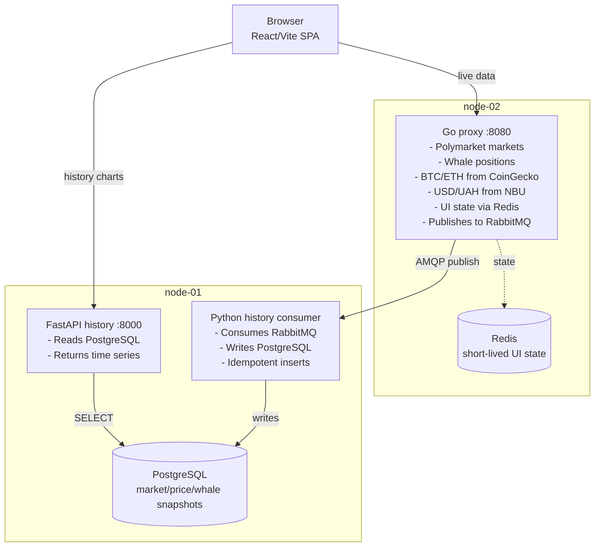

# Coin-Ops

Coin-Ops is a distributed Polymarket intelligence dashboard. It shows live markets, BTC/ETH prices, USD/UAH, whale-style position data, and historical probability charts across a small three-VM deployment.

The project is intentionally not a single web app. It separates live aggregation, async ingestion, historical storage, and UI delivery so the architecture is easy to reason about and easy to demonstrate.

**[📚 Read the Documentation](docs/)** | **[🤝 How to Contribute](CONTRIBUTING.md)**

## Quick Start
1.  **Clone the repository**:
    ```bash
    git clone https://github.com/ua-academy-projects/coin-ops.git
    cd coin-ops
    ```
2.  **Launch Docker Stack**:
    ```bash
    docker compose up -d
    ```
3.  **Open the UI**:
    Open [http://localhost:5000](http://localhost:5000) (or the mapped Compose port) in your browser.

## Architecture



| VM | IP | Runs |
| --- | --- | --- |
| node-01 | `172.31.1.10` | PostgreSQL, RabbitMQ, history consumer, history API |
| node-02 | `172.31.1.11` | Go proxy, Redis |
| node-03 | `172.31.1.12` | nginx, React SPA |

## Data Flow

| Path | Flow | Purpose |
| --- | --- | --- |
| Live path | Browser -> Go proxy -> external APIs -> Browser | Fast current market data |
| Write path | Go proxy -> RabbitMQ -> Python consumer -> PostgreSQL | Async persistence |
| History path | Browser -> FastAPI -> PostgreSQL -> Browser | Chart time series |

The proxy does not write directly to PostgreSQL. It publishes events into RabbitMQ, and the consumer owns database writes. That keeps the live request path independent from database latency.

## Tech Stack

| Layer | Tech |
| --- | --- |
| Frontend | React, Vite, TypeScript, Tailwind, Recharts |
| Live gateway | Go |
| History API and consumer | Python, FastAPI, pika |
| Queue | RabbitMQ |
| Database | PostgreSQL |
| Cache | Redis |
| Containers | Docker, Docker Compose |
| Infrastructure | Terraform for Hyper-V VMs, Ansible for provisioning/deploy |
| Web server | nginx inside the UI container |

## Repository Layout

```text
.
|-- ansible/          # provisioning and deployment automation
|-- deploy/compose/   # per-node Docker Compose stacks
|-- history/          # FastAPI history API, RabbitMQ consumer, schema
|-- proxy/            # Go live-data proxy
|-- terraform/        # Hyper-V VM and network provisioning
|-- ui/               # legacy static UI
`-- ui-react/         # main React/Vite frontend
```

## Container Images

Each application service has its own Dockerfile.

| Image | Dockerfile | Runtime shape |
| --- | --- | --- |
| Go proxy | `proxy/Dockerfile` | multi-stage build, `golang:1.22-alpine` builder, `scratch` runtime |
| History API | `history/Dockerfile.api` | `python:3.12-slim-bookworm`, non-root user |
| History consumer | `history/Dockerfile.consumer` | `python:3.12-slim-bookworm`, non-root user |
| UI | `ui-react/Dockerfile` | `node:22-bookworm-slim` builder, `nginx:alpine` runtime |

Official images are used for PostgreSQL, RabbitMQ, and Redis.

## Registry Deployment Model

Application images are built once by GitHub Actions and pushed to GitHub Container Registry:

```text
push to Shabat
  -> GitHub Actions builds Docker images
  -> images are pushed to ghcr.io/ua-academy-projects/coin-ops-<service>
  -> Ansible renders per-node Compose files
  -> Docker Compose pulls images by tag
  -> docker compose up -d starts containers
```

The VMs do not need application source code for deployment. They only need Docker, Compose files, runtime env files, and network access to GHCR. The default tag is `shabat-latest`; set `IMAGE_TAG=<commit-sha>` or `IMAGE_TAG=vX.Y.Z` for immutable rollouts or rollback.

SemVer Git tags (`v0.1.0`, `v0.2.0`, etc.) trigger the same image build workflow and publish matching GHCR image tags. Branch pushes still publish `shabat-latest` for quick demos.

Version numbers follow SemVer:

```text
vMAJOR.MINOR.PATCH
```

Use `PATCH` for fixes only, for example `v0.1.0 -> v0.1.1`. Use `MINOR` for compatible new capabilities, for example `v0.1.0 -> v0.2.0`. Use `MAJOR` for breaking changes, for example `v1.4.2 -> v2.0.0`. This project starts at `v0.1.0` because it is the first stable baseline before a formal `v1.0.0` release.

## Public Gateway and TLS

Node-03 is the browser-facing gateway. It serves the React UI and reverse-proxies same-origin backend paths:

```text
https://coinops.test/              -> React UI
https://coinops.test/api/*         -> node-02 proxy
https://coinops.test/history-api/* -> node-01 history API
```

For local lab HTTPS, keep `APP_DOMAIN=coinops.test`, `TLS_MODE=selfsigned`, and add this hosts entry on the machine running the browser:

```text
172.31.1.12 coinops.test
```

The self-signed certificate will show a browser trust warning. For a real domain, point DNS to node-03 and replace the self-signed cert with a trusted certificate using `TLS_MODE=provided`; the UI node expects `/etc/cognitor/tls/coinops.crt` and `/etc/cognitor/tls/coinops.key`.

## Secrets and Runtime Configuration

Secrets are not baked into Docker images. Ansible writes root-owned env files on the VMs under `/etc/cognitor/`, and Docker Compose injects those values at container startup with `env_file`.

This keeps images environment-agnostic and safe to publish. For this project scale, host env files are a reasonable tradeoff. In a larger production system, this would usually move to Vault, a cloud secrets manager, Docker Swarm secrets, or Kubernetes secrets.

## Deployment

Prepare environment variables first:

```bash
cp .env.example .env
source .env
```

Install pinned Ansible collections:

```bash
ansible-galaxy collection install -r ansible/requirements.yml
```

Provision infrastructure:

```bash
terraform -chdir=terraform apply
```

Install host dependencies and Docker:

```bash
ansible-playbook -i ansible/inventory ansible/provision.yml
```

Deploy application containers:

```bash
ansible-playbook -i ansible/inventory ansible/deploy.yml
```

This deploys the moving branch image tag by default:

```text
IMAGE_TAG=shabat-latest
```

Use this for active demos after pushing to the `Shabat` branch. GitHub Actions rebuilds `shabat-latest`, and Ansible pulls that current image.

If GHCR packages are private, export registry credentials first. The token only needs package read access:

```bash
export GHCR_USERNAME=<github-username>
export GHCR_TOKEN=<github-token-with-read-packages>
ansible-playbook -i ansible/inventory ansible/deploy.yml
```

Deploy a stable release tag:

```bash
IMAGE_TAG=v0.1.0 ansible-playbook -i ansible/inventory ansible/deploy.yml
```

Use this for production-style deploys. `v0.1.0` is immutable: it points to the exact image built from the `v0.1.0` Git tag. Rollback is the same operation with an older tag, for example `IMAGE_TAG=v0.0.9`.

Deploy an exact commit image when debugging or proving reproducibility:

```bash
IMAGE_TAG=<full-commit-sha> ansible-playbook -i ansible/inventory ansible/deploy.yml
```

Live demo release flow:

```bash
# 1. Push the current branch so shabat-latest images build
git push origin Shabat

# 2. Create a visible SemVer release tag from the current commit
git tag -a v0.1.0 -m "Release v0.1.0"
git push origin v0.1.0

# 3. Wait for GitHub Actions to finish publishing GHCR images

# 4. Deploy the pinned release
IMAGE_TAG=v0.1.0 ansible-playbook -i ansible/inventory ansible/deploy.yml
```

If the tag already exists, do not recreate it during the demo. Either deploy the existing tag or create the next version, for example `v0.1.1` for a small fix or `v0.2.0` for new sprint work.

Deploy only one node:

```bash
ansible-playbook -i ansible/inventory ansible/deploy.yml --limit softserve-node-02
```

## Local Development

Frontend:

```bash
cd ui-react
npm install
npm run dev
npm run lint
npm run build
```

Go proxy:

```bash
cd proxy
make run
make build
```

Python history services:

```bash
cd history
python -m venv venv
source venv/bin/activate
pip install -r requirements.txt
python main.py
python consumer.py
```

## External Data Sources

| Source | Data |
| --- | --- |
| `gamma-api.polymarket.com` | live market metadata |
| `data-api.polymarket.com` | whale leaderboard and positions |
| `api.coingecko.com` | BTC and ETH prices |
| `bank.gov.ua` | USD/UAH reference rate |

These are public unauthenticated APIs, so live behavior depends on upstream availability and rate limits.

## Operational Notes

The deployment is safe to re-run. Ansible stops legacy host services, removes old synced source directories, renders current Compose files, pulls registry images, starts containers, waits for health endpoints, and prunes dangling images.

Persistent data is stored on VM-mounted host paths under `/var/lib/coin-ops/`, not inside disposable container layers.
