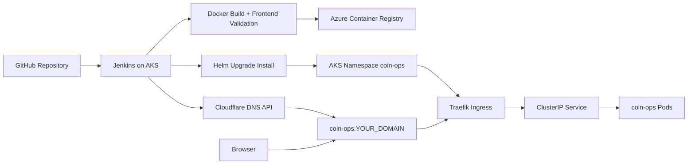

# Coin-Ops

Coin-Ops is a distributed Polymarket dashboard deployed across three VMs. The default deployed path on `dev` is still a containerized React + Go + Python system that uses RabbitMQ for asynchronous ingestion and Redis for short-lived UI session state.

At the same time, the roadmap from the April 20-21, 2026 GitHub issues has already started landing on `dev`:

- `dev` is the integration branch for team PRs
- PR validation now runs on pull requests into `dev`
- pushes to `dev` now publish `dev-latest` images
- queue-side PostgreSQL runtime assets are present under `runtime/`
- the full proxy/consumer/deploy cutover behind `RUNTIME_BACKEND=external|postgres` is still pending
- RabbitMQ and Redis are still part of the default deployment until that cutover is verified

**[Read the Documentation](docs/)** | **[How to Contribute](CONTRIBUTING.md)**

## Status Snapshot

| Topic | Current repo state on `dev` | Next planned step |
| --- | --- | --- |
| Runtime backend | Default deployed path is `external`: RabbitMQ queue + Redis session state | Add service/deploy switching so proxy and consumer can run in `postgres` mode |
| Runtime queue assets | `runtime/` already contains `pgmq` queue SQL, DLQ, `LISTEN/NOTIFY`, advisory locks, and `runtime_consumer.py` | Wire proxy and deployment to use those assets |
| Frontend contract | same-origin `/api` and `/history-api` | keep the same HTTP contract while backend internals change |
| Deployment shape | Docker Compose on three VMs via Ansible | keep the three-VM story during the migration |
| Image publishing | `Shabat` -> `shabat-latest`, `dev` -> `dev-latest`, tags -> `vX.Y.Z` | use moving branch tags for integration/demo deploys and tags for pinned releases |
| Validation | PR checks run on pull requests into `dev` | extend the test pyramid beyond the current baseline over time |

## Current Architecture (`external` runtime path)

```text
Browser
  |
  v
node-03
  ui container (nginx + React SPA)
  |
  +-- /api -----------> node-02 proxy container :8080
  |                       - fetches Polymarket markets
  |                       - fetches whale leaderboard/positions
  |                       - fetches BTC/ETH and USD/UAH
  |                       - stores session JSON in Redis
  |                       - publishes market/price events to RabbitMQ
  |
  +-- /history-api ---> node-01 history-api container :8000
                          - reads PostgreSQL history tables

node-01
  postgres container
  rabbitmq container
  history-consumer container
    - consumes `market_events`
    - writes `market_snapshots` and `price_snapshots`

node-02
  redis container
```

| VM | IP | Runtime services |
| --- | --- | --- |
| node-01 | `172.31.1.10` | PostgreSQL, RabbitMQ, history consumer, history API |
| node-02 | `172.31.1.11` | Go proxy, Redis |
| node-03 | `172.31.1.12` | nginx gateway, React SPA |

## Current Data Flow

| Path | Flow | Purpose |
| --- | --- | --- |
| Live path | Browser -> `/api` -> Go proxy -> external APIs -> Browser | fast live market data |
| Write path | Go proxy -> RabbitMQ -> Python consumer -> PostgreSQL | async persistence |
| History path | Browser -> `/history-api` -> FastAPI -> PostgreSQL -> Browser | chart time series |
| Session path | Browser -> `/api/state` -> Redis | short-lived UI state |

The browser does not call `172.31.1.10:8000` or `172.31.1.11:8080` directly. Node-03 keeps the frontend same-origin by reverse-proxying `/api` and `/history-api`.

## Roadmap Status

### Already adopted on `dev`

- `dev` is the intended integration branch
- PR checks exist in `.github/workflows/pr-checks.yml`
- GHCR publishing for `dev-latest` exists in `.github/workflows/docker-images.yml`
- PostgreSQL queue-side runtime SQL and `runtime_consumer.py` exist under `runtime/`

### Still in progress

- adding `RUNTIME_BACKEND=external|postgres` wiring to proxy and consumer startup paths
- switching proxy event publishing from RabbitMQ to `runtime.enqueue_event(...)`
- switching deployed consumption from `history/consumer.py` to `runtime/runtime_consumer.py`
- wiring runtime schema/bootstrap into Ansible and Compose
- moving Redis-backed session/cache behavior into PostgreSQL runtime primitives
- removing RabbitMQ and Redis only after the PostgreSQL runtime path is verified

## Tech Stack

| Layer | Tech |
| --- | --- |
| Frontend | React, Vite, TypeScript, Tailwind, Recharts |
| Live gateway | Go |
| History API and current consumer | Python, FastAPI, pika |
| Queue | RabbitMQ for the default deployed path; `pgmq` queue assets merged under `runtime/` |
| Database | PostgreSQL |
| Session/runtime state | Redis today, PostgreSQL runtime consolidation planned |
| Containers | Docker, Docker Compose |
| Infrastructure | Terraform for VM provisioning, Ansible for deployment |
| Web server | nginx |

## Repository Layout

```text
.
|-- ansible/          # provisioning and deployment automation
|-- deploy/compose/   # per-node Docker Compose stacks
|-- docs/             # architecture, deployment, and runbook notes
|-- history/          # FastAPI history API, RabbitMQ consumer, schema
|-- proxy/            # Go live-data proxy
|-- runtime/          # PostgreSQL runtime queue SQL and pgmq-backed consumer assets
|-- terraform/        # VM and network provisioning
|-- ui/               # legacy static UI
`-- ui-react/         # main React/Vite frontend
```

## Container Images

Each application service has its own Dockerfile.

| Image | Dockerfile | Runtime shape |
| --- | --- | --- |
| Go proxy | `proxy/Dockerfile` | multi-stage build, `golang:1.22-alpine` builder, `scratch` runtime |
| History API | `history/Dockerfile.api` | `python:3.12-slim-bookworm` |
| History consumer | `history/Dockerfile.consumer` | `python:3.12-slim-bookworm` |
| UI | `ui-react/Dockerfile` | `node:22-bookworm-slim` builder, `nginx:alpine` runtime |

Official images are still used for PostgreSQL, RabbitMQ, and Redis. The queue-side PostgreSQL runtime SQL assumes `pgmq` is available in PostgreSQL, but the default deployment has not been switched over to that path yet.

## Deployment Model

Application images are built by GitHub Actions and pushed to GitHub Container Registry.

```text
push to Shabat
  -> publish shabat-latest

push to dev
  -> publish dev-latest

push tag vX.Y.Z
  -> publish immutable release images

Ansible deploy
  -> renders per-node Compose files and env files
  -> Docker Compose pulls tagged images
  -> containers start on node-01, node-02, and node-03
```

## Branches and Release Tags

Current branch and publishing model:

- `feature/*` -> PR -> `dev`
- `dev` is the integration branch
- `main` remains stable/release-oriented
- `Shabat` publishes moving `shabat-latest`
- `dev` publishes moving `dev-latest`
- `vX.Y.Z` publishes immutable release tags

Release tags are automated from Conventional Commit style squash merge titles on `main`. See [Release Automation](docs/release-automation.md) for the version bump rules and maintainer workflow.

## Public Gateway and TLS

Node-03 is the browser-facing gateway. It serves the React UI and reverse-proxies the backend paths:

```text
https://coinops.test/              -> React UI
https://coinops.test/api/*         -> node-02 proxy
https://coinops.test/history-api/* -> node-01 history API
```

For local lab HTTPS, keep `APP_DOMAIN=coinops.test`, `TLS_MODE=selfsigned`, and add this hosts entry on the machine running the browser:

```text
172.31.1.12 coinops.test
```

## Secrets and Runtime Configuration

Secrets are not baked into images. Ansible writes root-owned env files on the VMs under `/etc/cognitor/`, and Docker Compose injects those values at container startup with `env_file`.

Current runtime env highlights:

- proxy: `RABBITMQ_URL`, `REDIS_URL`, `PORT`
- history: `DATABASE_URL`, `RABBITMQ_URL`, `POSTGRES_*`, `PORT`
- ui: `PROXY_URL=/api`, `HISTORY_URL=/history-api`

Pending full PostgreSQL runtime mode still adds:

- `RUNTIME_BACKEND=external|postgres`
- proxy `DATABASE_URL`
- runtime schema/bootstrap in deployment before app containers start

## Deployment Commands

Prepare environment variables first:

```bash
cp .env.example .env
source .env
```

For the local root `docker compose` flow, use a plain Compose `.env` file and the root `Makefile` convenience targets:

```bash
cp .env.compose.example .env
make local-up
```

Equivalent direct Compose command:

```bash
docker compose up --build
```

## AKS CI/CD Path

The repository now also contains a production-like AKS deployment path for the browser-facing Coin-Ops UI:

```text
.
|-- Dockerfile                  # root Docker build for the UI runtime image
|-- Jenkinsfile                 # Jenkins pipeline for ACR -> AKS -> Cloudflare
|-- helm/coin-ops/             # Helm chart for the AKS deployment
|-- scripts/cloudflare-dns.sh  # Cloudflare DNS upsert helper
`-- ui-react/                  # deployed browser-facing application source
```

This AKS pipeline deploys the public React/nginx service and preserves the same-origin frontend contract:

- `PROXY_URL=/api`
- `HISTORY_URL=/history-api`

That means the UI remains compatible with the existing browser routing model. If you later move the Go proxy and FastAPI history API into AKS, keep those paths unchanged behind the ingress.

### Jenkins Credentials

Create these Jenkins credentials before running the pipeline:

| Credential ID | Type | Purpose |
| --- | --- | --- |
| `AZURE_CLIENT_ID` | Secret text | Azure service principal client ID |
| `AZURE_CLIENT_SECRET` | Secret text | Azure service principal secret |
| `AZURE_TENANT_ID` | Secret text | Azure tenant ID |
| `AZURE_SUBSCRIPTION_ID` | Secret text | Azure subscription ID |
| `ACR_NAME` | Secret text | Azure Container Registry name |
| `CLOUDFLARE_API_TOKEN` | Secret text | Cloudflare API token with DNS edit access |
| `CLOUDFLARE_ZONE_ID` | Secret text | Cloudflare zone ID for the target domain |
| `KUBECONFIG` | Secret file | kubeconfig for the AKS cluster |

`APP_DOMAIN` is exposed as a Jenkins pipeline parameter. For `example.com`, the pipeline creates and validates `coin-ops.example.com`.

If you want Jenkins bootstrapped automatically from the already provisioned AKS/Jenkins stack, use:

```bash
./scripts/bootstrap-jenkins-job.sh
```

The script:

- sources the root `.env`
- reads Azure, ACR, Jenkins admin, and AKS values from `azure-aks-jenkins` Terraform outputs
- reads the Terraform service principal from `azure-aks-jenkins/.generated/terraform-sp.env`
- resolves `APP_DOMAIN` from `TF_VAR_cloudflare_zone_name` in `.env` by default
- resolves `CLOUDFLARE_API_TOKEN` through the same `.env` / secret-manager flow used by `deploy.sh`
- resolves `CLOUDFLARE_ZONE_ID` from Cloudflare API automatically when the zone name is known
- pulls a fresh AKS kubeconfig with `az aks get-credentials`
- resolves the Jenkins LoadBalancer endpoint from Kubernetes
- creates or updates the required Jenkins credentials through the Jenkins API
- creates or updates the Pipeline job pointing at the root `Jenkinsfile`
- optionally triggers the first build

Optional environment variables:

| Variable | Default | Purpose |
| --- | --- | --- |
| `JOB_NAME` | `coin-ops-aks-cd` | Jenkins job name |
| `TRIGGER_INITIAL_BUILD` | `true` | Set to `false` to skip the first build |
| `JENKINS_GIT_CREDENTIALS_ID` | empty | Use when the Git repository is private |
| `APP_DOMAIN` | from `.env` / `TF_VAR_cloudflare_zone_name` | Override the base domain explicitly |
| `CLOUDFLARE_API_TOKEN` | from `.env` / secret manager | Override the Cloudflare token explicitly |
| `CLOUDFLARE_ZONE_ID` | auto-resolved | Override the zone ID explicitly |

### Pipeline Flow

The root `Jenkinsfile` implements these stages:

1. Checkout source code from GitHub.
2. Build the root Docker image.
3. Run frontend validation with `npm ci`, `npm run lint`, and `npm run test:run`.
4. Log in to Azure, resolve the ACR login server, and push three tags:
   - `${BUILD_NUMBER}-${short_sha}`
   - `${short_sha}`
   - `build-${BUILD_NUMBER}`
5. Deploy the Helm release with `helm upgrade --install --create-namespace`.
6. Wait for the Kubernetes rollout to complete.
7. Resolve the ingress external IP.
8. Create or update the Cloudflare proxied `A` record.
9. Verify `https://coin-ops.YOUR_DOMAIN` with `curl`.

If a deployment fails after a previous successful Helm release exists, the pipeline automatically rolls back to the last deployed revision.

### Helm Deployment

The chart lives in [helm/coin-ops](helm/coin-ops) and creates:

- `Deployment`
- `Service`
- `Ingress`
- `ConfigMap`
- `Secret`

Default Kubernetes characteristics:

- namespace: `coin-ops`
- service type: `ClusterIP`
- ingress class: `traefik`
- TLS enabled
- rolling updates with `maxUnavailable=0` and `maxSurge=1`
- readiness and liveness probes on `/health`
- configurable replica count, resources, and runtime paths

Use:

- [helm/coin-ops/values-dev.yaml](helm/coin-ops/values-dev.yaml) for lower-footprint dev defaults
- [helm/coin-ops/values-prod.yaml](helm/coin-ops/values-prod.yaml) for production-like defaults

### Manual Deployment Equivalent

The Jenkins deployment stage is equivalent to:

```bash
helm upgrade --install coin-ops ./helm/coin-ops \
  --namespace coin-ops \
  --create-namespace \
  -f ./helm/coin-ops/values.yaml \
  -f ./helm/coin-ops/values-prod.yaml \
  --set-string image.repository="<acr-login-server>/coin-ops" \
  --set-string image.tag="<build-tag>" \
  --set-string ingress.host="coin-ops.example.com" \
  --set-string ingress.tls.secretName="coin-ops-tls" \
  --wait \
  --timeout 10m
```

### Rollback Procedure

Automatic rollback is built into the pipeline. Manual rollback is:

```bash
helm history coin-ops -n coin-ops
helm rollback coin-ops <REVISION> -n coin-ops --wait --timeout 10m
kubectl rollout status deployment/coin-ops -n coin-ops --timeout=300s
```

### Architecture Diagram


```mermaid
flowchart LR
  GitHub[GitHub Repository] --> Jenkins[Jenkins on AKS]
  Jenkins --> Build[Docker Build + Frontend Validation]
  Build --> ACR[Azure Container Registry]
  Jenkins --> Helm[Helm Upgrade Install]
  Helm --> AKS[AKS Namespace coin-ops]
  AKS --> Ingress[Traefik Ingress]
  Ingress --> Service[ClusterIP Service]
  Service --> Pods[coin-ops Pods]
  Jenkins --> CF[Cloudflare DNS API]
  CF --> DNS[coin-ops.YOUR_DOMAIN]
  DNS --> Ingress
  User[Browser] --> DNS
```

### Notes

- The root `Dockerfile` builds from `ui-react/` and packages the result in `nginx:alpine`.
- The Cloudflare script intentionally performs `GET -> PUT/POST` so the pipeline remains idempotent.
- The pipeline assumes Jenkins agents already have `docker`, `az`, `kubectl`, `helm`, `curl`, and `python3`.
- TLS in the ingress assumes a compatible certificate flow exists in the cluster, typically via `cert-manager` and a `ClusterIssuer` referenced in ingress annotations.

For the Kubespray-based Kubernetes lab, the repo also contains a simple
`gethomepage/homepage` deployment under `k8s/homepage/`. After ingress-nginx is
installed in the cluster, deploy it with:

```bash
HOMEPAGE_HOST=homepage.example.com ./scripts/deploy-homepage.sh
```

The script applies the Kubernetes manifests and then creates or updates the
matching Cloudflare `CNAME` record so the chosen host points at the AWS ALB
from `terraform.kubespray.aws`. It expects `CLOUDFLARE_API_TOKEN` and
`TF_VAR_cloudflare_zone_name` to be available in the environment or `.env`.

The full AWS + Kubespray + ingress-nginx + Homepage + Headlamp lab runbook
lives in [terraform.kubespray.aws/README.md](terraform.kubespray.aws/README.md).

This local flow is a developer convenience stack for the default root Compose setup. It does not replace the VM-based Terraform + Ansible deployment flow.

Install pinned Ansible collections:

```bash
ansible-galaxy collection install -r ansible/requirements.yml
```

## Cloud Deployment

The multi-cloud infrastructure and deployment flow lives under
`terraform.gcp.aws/`.

Recommended entrypoint:

```bash
./deploy.sh
```

`deploy.sh` does the following:

- loads `.env`
- selects the Terraform backend for the target cloud
- runs `terraform init`
- applies infrastructure for the selected cloud
- generates `ansible/inventory.generated`
- runs `ansible/provision.yml`
- runs `ansible/deploy.yml`

Recommended preflight scripts:

```bash
./scripts/bootstrap-aws.sh
./scripts/bootstrap-gcp.sh
./scripts/bootstrap-azure.sh
```

### Select the cloud

Cloud selection is controlled by Terraform variable `cloud` in
`terraform.gcp.aws/variables.tf`, or can be overridden at runtime:

```bash
CLOUD_PROVIDER=aws ./deploy.sh
CLOUD_PROVIDER=gcp ./deploy.sh
CLOUD_PROVIDER=azure ./deploy.sh
```

If `CLOUD_PROVIDER` is not set, `deploy.sh` uses the default from
`terraform.gcp.aws/variables.tf`.

### Run in GCP

Run the preflight:

```bash
./scripts/bootstrap-gcp.sh
```

Then deploy:

```bash
CLOUD_PROVIDER=gcp ./deploy.sh
```

After deployment, get the public load balancer IP:

```bash
terraform -chdir=terraform.gcp.aws output
```

Open:

```text
http://<load_balancer_ip_address>
```

For Cloudflare on GCP, use an **A record** pointing to the load balancer IP.

### Run in AWS

Run the preflight:

```bash
./scripts/bootstrap-aws.sh
```

Then deploy:

```bash
CLOUD_PROVIDER=aws ./deploy.sh
```

After deployment, get the public load balancer address:

```bash
terraform -chdir=terraform.gcp.aws output
```

Open either:

```text
http://<load_balancer_dns_name>
```

or your public domain if Cloudflare is configured.

### Run in Azure

Run the preflight:

```bash
./scripts/bootstrap-azure.sh
```

Then deploy:

```bash
CLOUD_PROVIDER=azure ./deploy.sh
```

After deployment, get the public IP:

```bash
terraform -chdir=terraform.gcp.aws output
```

Open:

```text
http://<load_balancer_ip_address>
```

Open:

```text
http://<load_balancer_ip_address>
```

For Cloudflare on AWS, use a **CNAME** pointing to the ELB DNS name.

### Manual flow

Provision infrastructure manually:

```bash
terraform -chdir=terraform.gcp.aws apply -var="cloud=<aws|gcp>"
```

Terraform writes the Ansible inventory automatically to
`ansible/inventory.generated`.

Install host dependencies and Docker:

```bash
ansible-playbook -i ansible/inventory.generated ansible/provision.yml
```

Deploy application containers:

```bash
ansible-playbook -i ansible/inventory.generated ansible/deploy.yml
```

### Separate DB inventory mode

AWS-style deployment with PostgreSQL on a separate VM is supported by adding a
`[db]` group to the inventory. See `ansible/inventory.aws.example`:

```text
[db]      -> PostgreSQL container only
[history] -> history-api, history-consumer, RabbitMQ only in external mode
[proxy]   -> proxy, Redis only in external mode
[ui]      -> browser-facing nginx/UI container
```

Run the same playbooks with the AWS inventory:

```bash
ansible-playbook -i ansible/inventory.aws.example ansible/provision.yml
ansible-playbook -i ansible/inventory.aws.example ansible/deploy.yml
```

When `[db]` exists, Ansible deploys PostgreSQL first, applies the application
schema and PostgreSQL runtime schema there, and only then starts the app
containers.

Current moving-tag deploys:

```bash
IMAGE_TAG=shabat-latest ansible-playbook -i ansible/inventory.generated ansible/deploy.yml
IMAGE_TAG=dev-latest ansible-playbook -i ansible/inventory.generated ansible/deploy.yml
```

Pinned release deploy:

```bash
IMAGE_TAG=v0.1.0 ansible-playbook -i ansible/inventory.generated ansible/deploy.yml
```

## Local Development

Quick local Compose workflow:

```bash
cp .env.compose.example .env
make local-up
```

Open the app at `http://localhost:5000`.

Useful local commands:

```bash
make local-logs
make local-ps
make local-down
make local-restart
make local-config
```

Frontend:

```bash
cd ui-react
npm install
npm run dev
npm run lint
npm run build
```

Go proxy:

```bash
cd proxy
make run
make build
```

Python history services:

```bash
cd history
python -m venv venv
source venv/bin/activate
pip install -r requirements.txt
python main.py
python consumer.py
```

Queue-side PostgreSQL runtime assets:

```bash
psql "$DATABASE_URL" -f runtime/00_run_all.sql
python runtime/runtime_consumer.py
```

Fast Python unit tests for both the current `external` path and the PostgreSQL runtime target:

```bash
cd <repo-root>
python -m venv venv
source venv/bin/activate
pip install -r history/requirements-dev.txt
python -m pytest tests/python/unit
```

If you are already in `history/`, either `cd ..` first or run `python -m pytest ../tests/python/unit`.

The fast `pytest` suite lives under `tests/python/unit`. Keep PostgreSQL-backed integration coverage separate from these unit tests.

PostgreSQL-backed integration tests for `history/main.py` and the queue-side PostgreSQL consumer in `runtime/runtime_consumer.py` (requires Docker):

```bash
cd <repo-root>
python -m venv venv
source venv/bin/activate
pip install -r history/requirements-dev.txt
python -m pytest tests/python/integration -v
```

These integration tests boot an ephemeral runtime-ready PostgreSQL container (`quay.io/tembo/pg16-pgmq@sha256:7f80d046257d585d1af9d19cf28bd355a4b854b0a7d643c02ebbe6b84457868a` by default, override with `COINOPS_TEST_POSTGRES_IMAGE`), apply `history/schema.sql` plus `runtime/00_run_all.sql`, and validate real history read/write behavior through the actual PostgreSQL queue path.

They do not replace the broader runtime smoke tests in `runtime/tests/test_runtime.sql`; cache/session `pg_cron` coverage still lives there.

## External Data Sources

| Source | Data |
| --- | --- |
| `gamma-api.polymarket.com` | live market metadata |
| `data-api.polymarket.com` | whale leaderboard and positions |
| `api.coingecko.com` | BTC and ETH prices |
| `bank.gov.ua` | USD/UAH reference rate |

These are public unauthenticated APIs, so live behavior depends on upstream availability and rate limits.

## More Detail

- [docs/architecture.md](docs/architecture.md) explains the current deployed path versus the PostgreSQL runtime target.
- [docs/runtime-queue-architecture.md](docs/runtime-queue-architecture.md) focuses on the queue-side PostgreSQL runtime design and its current status on `dev`.
