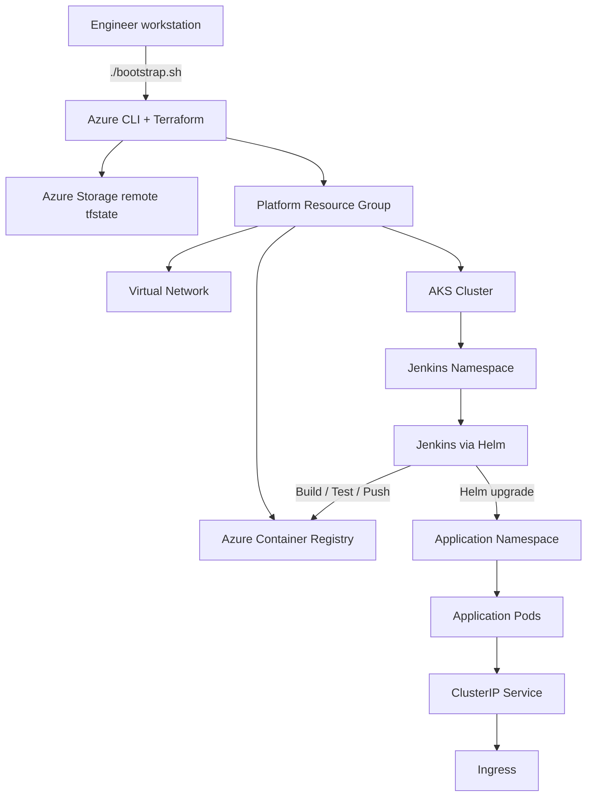

# Architecture

## Component Explanation

- **bootstrap.sh**: local entrypoint that prepares backend, credentials, and Terraform execution.
- **Azure Storage backend**: remote state store for Terraform.
- **AKS**: target runtime cluster for Jenkins and the sample application.
- **ACR**: image registry for the CI/CD pipeline.
- **Jenkins**: CI/CD orchestrator running inside AKS.
- **Helm app chart**: application delivery unit for dev/prod values.

