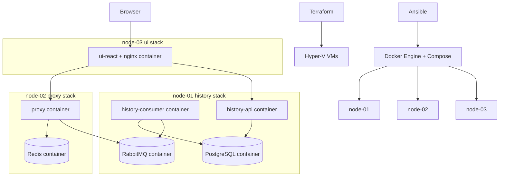

# Containerization Adoption Plan

## Goal

Adopt containerization without discarding the current infrastructure story.

The target state is:

- Terraform still creates the Hyper-V virtual machines and networking.
- Ansible still provisions and deploys the environment.
- Application services run in containers on the VMs.
- Host OSes stop carrying most language/runtime-specific deployment logic.

This keeps the project architecture strong for a CV/demo:

- Terraform owns infrastructure
- Ansible owns host configuration and rollout
- Docker owns service packaging and runtime isolation

## Decision

### Recommended path

Use **Docker Engine + Docker Compose on each VM**.

Do **not** adopt k3s in the first implementation.

### Why Compose is the right fit now

This project already has a fixed node topology:

- `node-01`: PostgreSQL, RabbitMQ, history consumer, history API
- `node-02`: proxy, Redis
- `node-03`: UI

That means the main orchestration need is not scheduling or autoscaling. It is:

- packaging services consistently
- reducing host runtime drift
- making deployment reproducible
- preserving the existing VM boundaries

Official Docker guidance is aligned with this: Compose is a practical way to define and run multi-container applications, and Docker explicitly documents running Compose in production on a single server. In this project, each VM is effectively one production server running one Compose project.

### Why not k3s yet

k3s is not "Docker management". It is a Kubernetes distribution with control-plane, kubelet, networking, and cluster concerns.

That is useful when you need:

- scheduling across nodes
- service discovery and internal load balancing at cluster level
- declarative workload management through Kubernetes resources
- rolling updates and scaling across a cluster
- an actual Kubernetes platform story

It is not the best next step for this repo right now because:

1. The workloads are already intentionally pinned to specific VMs.
2. The project's main deployment value is Terraform + Ansible + service separation, not Kubernetes administration.
3. k3s adds control-plane, CNI, port, and resource overhead that does not solve the current bottleneck.
4. Official k3s requirements say HA server nodes need baseline CPU/RAM before accounting for workloads, and your current VMs are sized more like application nodes than Kubernetes control-plane nodes.

### Short conclusion

For implementation now:

- **Use Docker Compose on the VMs**
- **Keep k3s as an optional future branch, not the default deployment target**

## Target Architecture

## What Changes and What Stays

### Terraform

Terraform remains responsible for:

- VM creation
- static networking
- cloud-init/bootstrap inputs

Terraform does **not** become container-aware in the first phase.

Recommended Terraform changes:

- keep the 3-node layout unchanged
- increase `node-01` memory budget if needed
- consider increasing disk size if Postgres/RabbitMQ container volumes will grow over time

### Ansible

Ansible changes from:

- installing Go, Python, Redis, PostgreSQL, RabbitMQ, nginx directly
- building/running services as host processes

to:

- installing Docker Engine and Compose plugin
- creating persistent directories for bind mounts / data
- copying service source, Dockerfiles, compose files, and env files
- running `docker compose up -d --build`
- performing health checks after rollout

### Docker

Docker becomes the service delivery boundary:

- Go runtime goes inside the proxy image
- Python runtime and dependencies go inside history images
- Node build + nginx runtime go inside the UI image
- Redis/PostgreSQL/RabbitMQ run as official containers on their designated nodes

## Recommended Deployment Topology

### node-01

Compose project: `coinops-history`

Containers:

- `postgres`
- `rabbitmq`
- `history-consumer`
- `history-api`

Why:

- the consumer and history API already depend on Postgres and RabbitMQ
- colocating them preserves the current architecture
- keeps inter-service traffic simple on the history VM

### node-02

Compose project: `coinops-proxy`

Containers:

- `proxy`
- `redis`

Why:

- proxy already depends on Redis locally
- keeps Redis private to the proxy VM

### node-03

Compose project: `coinops-ui`

Containers:

- `ui`

Why:

- node-03 already serves only the web UI
- simplest possible rollout

## Inter-Node Networking

Cross-VM communication still happens over the VM private network.

### Publish only what must be reachable across nodes

`node-01`

- publish `8000` for `history-api`
- publish `5672` for `rabbitmq`
- do **not** publish PostgreSQL unless you explicitly need remote admin/debug access

`node-02`

- publish `8080` for `proxy`
- do **not** publish Redis externally

`node-03`

- publish `80` for the UI

This keeps the networking model close to the current setup and avoids introducing unnecessary exposure.

## Container Strategy by Service

### 1. Proxy

Recommended image strategy:

- builder: `golang:1.22-bookworm`
- runtime: distroless static image if the binary is fully static

Recommended approach:

- build with `CGO_ENABLED=0`
- run as non-root
- inject only runtime env vars

Why:

- small runtime image
- fewer host dependencies
- clean separation between build and runtime

### 2. History API and Consumer

Recommended base:

- `python:3.12-slim-bookworm`

Why not Alpine:

- higher chance of dependency friction
- lower practical payoff for this project
- worse tradeoff for reliability than slim Debian-based images

Recommended design:

- one shared Python base image pattern
- separate images or separate `CMD`s for `history-api` and `history-consumer`
- non-root runtime user

### 3. UI

Recommended image strategy:

- builder: `node:22-bookworm-slim`
- runtime: `nginx:alpine`

Recommended design:

- build React app in the builder stage
- copy built assets into nginx runtime image
- include the site config in the image

### 4. PostgreSQL / RabbitMQ / Redis

Use official images first.

Recommended starting point:

- PostgreSQL: official `postgres` image
- RabbitMQ: official `rabbitmq` image
- Redis: official `redis` image

This is better than inventing custom images for data services in the first pass.

## Persistent Data Design

Stateful containers must not rely on anonymous container storage.

Recommended persistent directories:

`node-01`

- `/var/lib/coin-ops/postgres`
- `/var/lib/coin-ops/rabbitmq`

`node-02`

- `/var/lib/coin-ops/redis`

Recommended initial approach:

- bind mounts or named volumes backed by those directories
- directories created by Ansible
- ownership/permissions managed explicitly

This keeps data persistent across container recreation.

## Secrets and Configuration

Keep the current secret model, but move consumption into containers.

Recommended pattern:

- Ansible writes env files under `/etc/cognitor/`
- Compose uses `env_file` or mounted env/config
- secrets remain out of the repo

Examples:

- `/etc/cognitor/proxy.env`
- `/etc/cognitor/history.env`
- `/etc/cognitor/ui.env` if needed

## Operations Model

### Recommended runtime management

Use Docker restart policies such as:

- `restart: unless-stopped`

This is enough for the first containerized deployment.

Optional later:

- systemd unit per Compose project
- log rotation policy for Docker logs
- image pull strategy via registry

### Health checks

Each application image should expose a real health endpoint or container healthcheck:

- proxy -> `/health`
- history-api -> `/health`
- UI -> nginx availability

RabbitMQ/PostgreSQL/Redis can rely on their standard readiness checks or container healthchecks where practical.

## Recommended Adoption Phases

### Phase 1 - Containerize services in repo

Deliverables:

- `proxy/Dockerfile`
- `history/Dockerfile.api`
- `history/Dockerfile.consumer`
- `ui-react/Dockerfile`
- `.dockerignore` files where needed

Acceptance criteria:

- each service image builds locally
- the UI image serves the built frontend
- proxy and history services run with only env configuration

### Phase 2 - Add per-node Compose stacks

Deliverables:

- `deploy/compose/node-01.compose.yaml`
- `deploy/compose/node-02.compose.yaml`
- `deploy/compose/node-03.compose.yaml`

Acceptance criteria:

- node-01 stack starts cleanly
- node-02 stack can reach RabbitMQ on node-01
- node-03 can reach proxy and history-api

### Phase 3 - Convert Ansible provisioning

Deliverables:

- install Docker Engine and Compose plugin on all nodes
- remove host runtime installs that containers now replace
- keep only host-level packages that are still needed

Acceptance criteria:

- fresh VM can be prepared without Go/Python/nginx/redis/postgres/rabbitmq host installs
- Docker is the only service runtime dependency

### Phase 4 - Convert Ansible deployment

Deliverables:

- sync compose files and env files
- sync source contexts if building on target
- run `docker compose up -d --build`
- run health checks

Acceptance criteria:

- one deploy command rolls out all three VM stacks
- redeploy works idempotently
- health checks pass after rollout

### Phase 5 - Cleanup and documentation

Deliverables:

- updated README architecture section
- deployment doc refresh
- operations commands for containers

Acceptance criteria:

- another engineer can understand how containers fit with Terraform and Ansible

## Implementation Detail Choices

## Choice A - Build images on target VMs first

Recommended first implementation.

How it works:

- Ansible syncs source to each VM
- `docker compose build`
- `docker compose up -d`

Pros:

- no registry needed
- easiest migration from current deploy process
- fewer moving pieces

Cons:

- slower deploys
- builds depend on VM resources

## Choice B - Use a container registry later

Recommended second-stage improvement.

How it works:

- CI builds images
- images pushed to registry
- VMs pull versioned images

Pros:

- cleaner deployments
- better rollback story
- faster rollout

Cons:

- adds registry and image version management

## Recommendation

Start with **Choice A**, then evolve to **Choice B** if the project continues.

## What To Remove From Host Provisioning

After containerization is in place, these host-level installs should no longer be required:

- Go toolchain
- Python virtualenv deployment path
- nginx as a host web server
- Redis as a host service
- RabbitMQ as a host service
- PostgreSQL as a host service

Host still needs:

- Docker Engine
- Docker Compose plugin
- basic OS tooling
- any SSH/rsync/system management packages Ansible depends on

## Resource Considerations

Current Terraform defaults show each VM at 2 vCPU and 2 GB RAM.

That may still be workable for Docker Compose, but `node-01` is the risk point because it will run:

- PostgreSQL
- RabbitMQ
- history-consumer
- history-api

Recommended adjustment before rollout:

- increase `node-01` to at least 3-4 GB RAM if available
- keep `node-02` at 2 GB unless proxy load grows
- keep `node-03` light

This is another reason to avoid k3s right now: cluster control-plane overhead would compete with the actual demo workload on already small VMs.

## k3s Re-evaluation Criteria

Revisit k3s only if one or more of these become true:

- you want Kubernetes specifically as a learning/demo objective
- you want self-healing and scheduling across nodes
- you want multiple replicas of stateless services
- you introduce CI-built images and a registry
- you are willing to increase VM resources and absorb cluster complexity

If you do revisit it later, do **not** start by moving everything into k3s at once. Keep stateful services conservative and migrate stateless services first.

## Execution Checklist

- [ ] Add Dockerfiles for proxy, history API, history consumer, and UI
- [ ] Add `.dockerignore` files
- [ ] Create per-node Compose files
- [ ] Create persistent data directories and mount strategy
- [ ] Add Ansible Docker installation role
- [ ] Replace host service deployment with Compose deployment
- [ ] Add container health checks
- [ ] Smoke test on existing 3 VMs
- [ ] Update README and deployment docs
- [ ] Consider registry-based deployment as a follow-up phase

## Recommended Final Positioning

Use this wording when describing the architecture:

"Terraform provisions the Hyper-V VMs, Ansible configures the hosts and deploys the stack, and Docker packages each service for consistent runtime behavior. The VMs remain the infrastructure boundary, while Docker becomes the service boundary."

That is the cleanest way to explain how containerization fits this project.

## References

- Docker Compose guide: https://docs.docker.com/guides/docker-compose/
- Docker Compose in production: https://docs.docker.com/compose/how-tos/production/
- Docker Engine on Ubuntu: https://docs.docker.com/installation/ubuntulinux/
- K3s overview: https://docs.k3s.io/
- K3s architecture: https://docs.k3s.io/architecture
- K3s requirements: https://docs.k3s.io/installation/requirements
